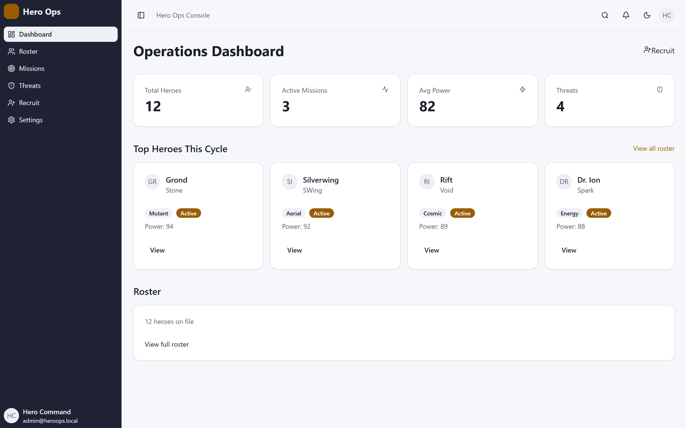
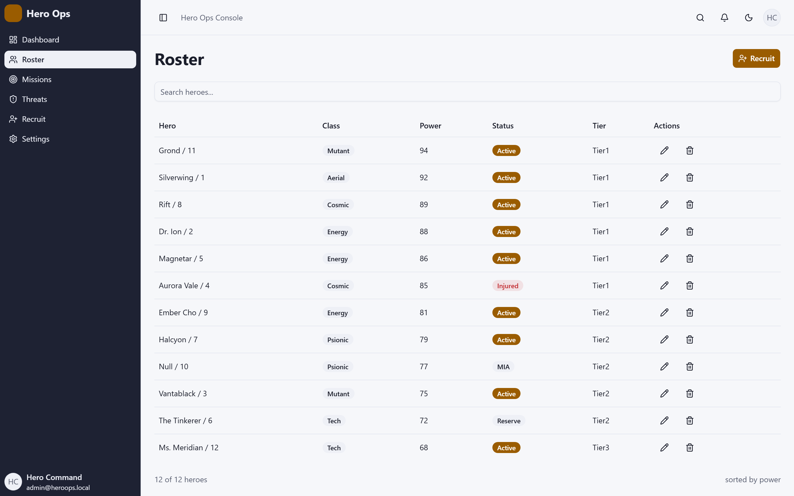
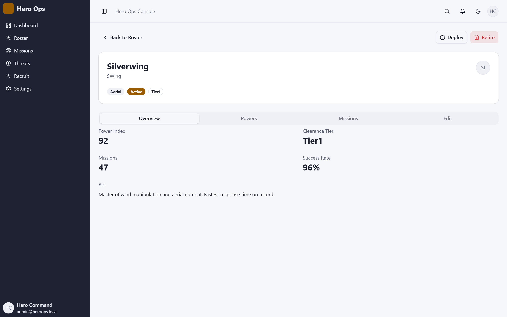
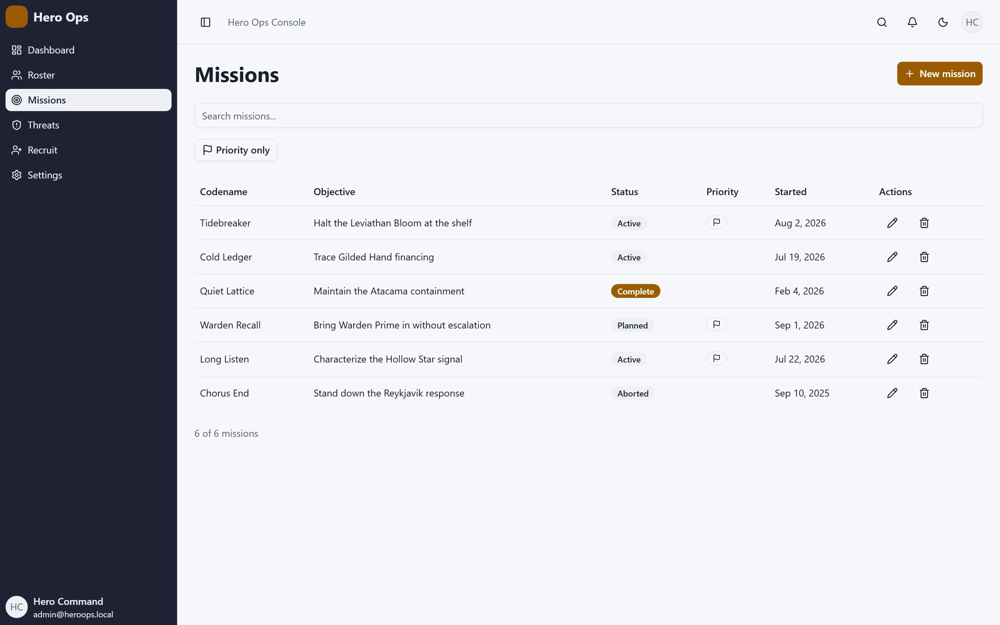
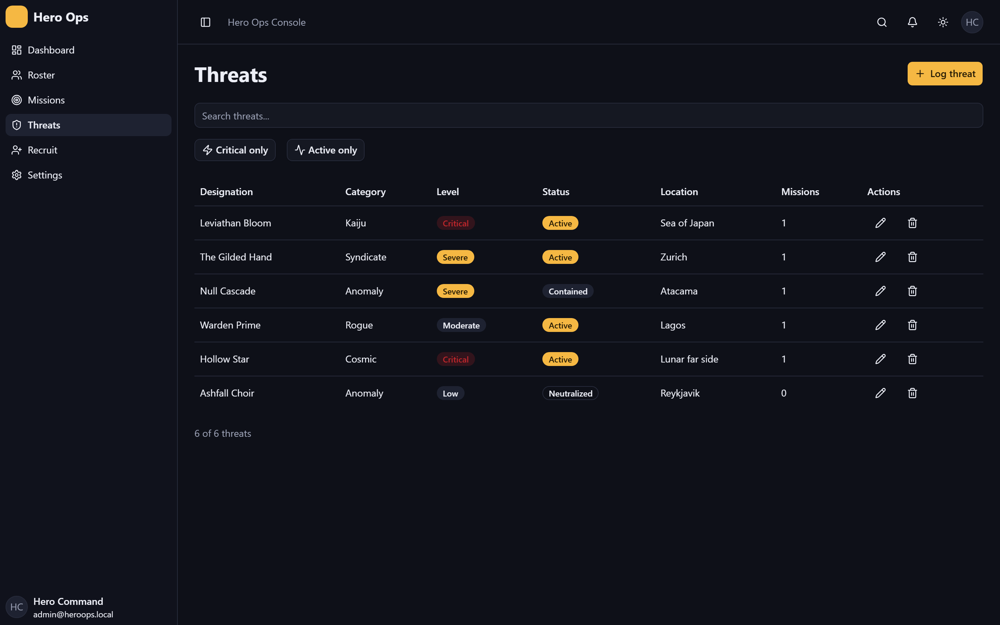
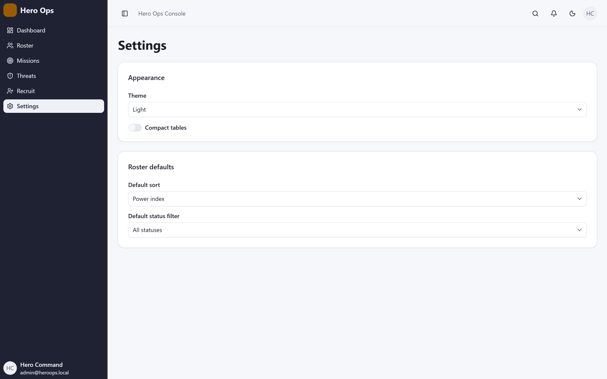
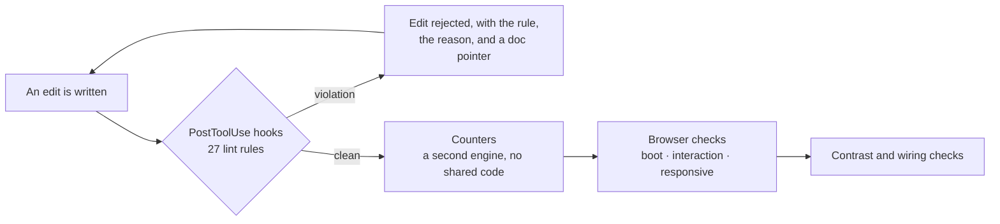

# Hero Ops Console

An opinionated Tour of Heroes, reimagined as a superhero agency's mission control — and written almost entirely by Haiku subagents working under a house constitution that is mechanically enforced rather than politely documented.



## What this is

Two things at once.

**An Angular 22 application.** Seven routes, four of them full CRUD: a roster of heroes, missions with linked threats, a threat register, a recruitment form, a hero dossier on tabs, and a settings screen whose preferences actually change other screens. Signals throughout, no RxJS in a component, Signal Forms driven by zod schemas, and every visual primitive composed from a vendored copy of [spartan/ui](https://www.spartan.ng).

**A test of whether house rules can be enforced instead of hoped for.** Twenty-seven lint rules encode this project's opinions about Angular. They are not advisory: they run as edit-time hooks that reject a write, they are audited by a second engine that shares no code with them, and three browser-based checks cover the defects no static rule can reach. The application was built by a fleet of Haiku subagents under those rules, one task at a time, with a review between each.

| | |
|---|---|
|  |  |
| Roster — table above `sm`, cards below | Hero dossier on `hlm-tabs` |
|  |  |
| Missions — dialog CRUD | Threats, dark theme |



Settings is the screen that proves the others are wired together: theme, default roster sort, status filter and table density are persisted preferences, and changing one here changes what the roster renders on the next visit. Theme resolves `system` through `prefers-color-scheme`, and survives an environment that has no `matchMedia` at all — which is what jsdom gives you, and what the original crash was.

## The house rules

Twenty-seven rules in four planes. Each has a doc under `harness/rules/` explaining what it forbids, why, the accepted form, and — the part that matters — its known blind spots.

**Sealed vocabulary** (`seal`) — use the design system, do not re-implement it.

`no-raw-control` · `no-appearance-on-primitive` · `no-style-attribute` · `no-raw-icon` · `no-unknown-primitive` · `no-missing-composition-part` · `no-unportalled-overlay`

A native `<button>` where a primitive exists is rejected. So is an appearance class on a primitive: colour, typography and padding belong in the vendored component or its `variant` input, never at the call site. Overlays must carry their required title *and* their structural portal — a `hlm-dialog-content` written without `*hlmDialogPortal` compiles, renders, and then silently fails to open.

**Component shape** (`shape`) — MVVM, and no leaking around it.

`no-root-provided-view-model` · `no-state-outside-view-model` · `no-feature-inject-data` · `no-unprovided-view-model` · `no-presentational-inject` · `no-component-subscribe` · `no-forms-module` · `no-reactive-form` · `no-ng-model` · `no-orphan-ng-submit` · `no-restated-validator` · `no-hand-set-change-detection` · `no-explicit-standalone` · `no-legacy-icon-module` · `no-unregistered-icon`

Every routed screen has a component-scoped ViewModel holding all state as signals. A feature component may not declare a `signal`, may not inject a data service, and may not `.subscribe` to anything — observables are converted at the edge with `toSignal`. Presentational components under `src/app/ui/` take inputs and outputs and inject nothing. Forms are Signal Forms over a zod schema, so a validator restated in TypeScript is a violation rather than a duplication.

**Layout grammar** (`layout`) — grid for regions, flex for runs.

`no-raw-palette-color` · `no-space-utility` · `no-nested-flex-grid` · plus `raw-css-literal` via stylelint

Semantic tokens only: `bg-card`, never `bg-blue-500` or a hex. Spacing is `gap-*` on the container, never `space-y-*` on the children. A row of flex columns arranged to line up as a grid is rejected, because that is what a grid is for.

**Framework freeloading** (`freeloader`) — use what Angular gives you.

`no-legacy-control-flow` · `no-ng-class-style`

Native `@if` / `@for` / `@switch`, and `class`/`style` bindings rather than `ngClass`/`ngStyle`.

## How they are enforced

Three layers, because each catches what the others structurally cannot.



**Edit-time hooks** reject a write and hand back the rule name, the reason, and a pointer to the rule's doc. There is no escape hatch: `noInlineConfig` disables `eslint-disable` wholesale, and a separate guard makes the enforcement configuration itself read-only, so the rules cannot be widened by whatever they are constraining.

**Independent counters** re-measure the same specs with a different parser and no shared code, so agreement between the two engines means something. `npm run count`.

**Checks a static rule cannot do.** `check:boot` renders every route and fails on a runtime error. `check:interaction` drives a real browser, clicks every overlay trigger, and asserts each one opens, dismisses, and logs nothing — the class of defect that compiles cleanly and fails only when a user clicks. `check:responsive` asserts no horizontal overflow at 375, 768 and 1280. `check:contrast` computes WCAG ratios over the design tokens. `check:wiring` finds a public method that no template ever calls.

That last one exists because a ViewModel method defined and wired to nothing is invisible to every other instrument: the counters read zero, the tests pass, the page renders, and the button does nothing.

## Running it

```bash
npm install
npm start          # http://localhost:4200
```

Verification:

```bash
npm run lint             # 27 rules over src
npm test                 # unit tests
npm run build            # production build
npm run check:boot       # every route renders without a runtime error
npm run check:interaction # every overlay opens, closes, and stays quiet
npm run check:responsive # 375 / 768 / 1280
npm run check:contrast   # WCAG AA over the design tokens
npm run check:wiring     # no orphaned ViewModel or component members
npm run count            # independent drift tally
npm run test:harness     # the rules' own test suite
```

## Layout

```
src/app/            the application
  <feature>/          screen, its ViewModel, its template
  ui/                 presentational components: inputs and outputs only
  <entity>/           model, zod schema, service, example data
libs/ui/            vendored spartan primitives, owned and editable
harness/
  gate/rules/         the 27 rules
  gate/               browser and token checks
  counter/            the independent measuring engine
  rules/              one doc per rule, including its blind spots
  *-spec.md           the specs both engines encode
```

## Stack

Angular 22 · TypeScript · signals and Signal Forms · zod · spartan/ui (Brain + Helm) · Tailwind 4 · lucide icons · Vitest · Playwright · ESLint with custom rules · stylelint

Data is in-memory example data, seeded on load. There is no backend.
