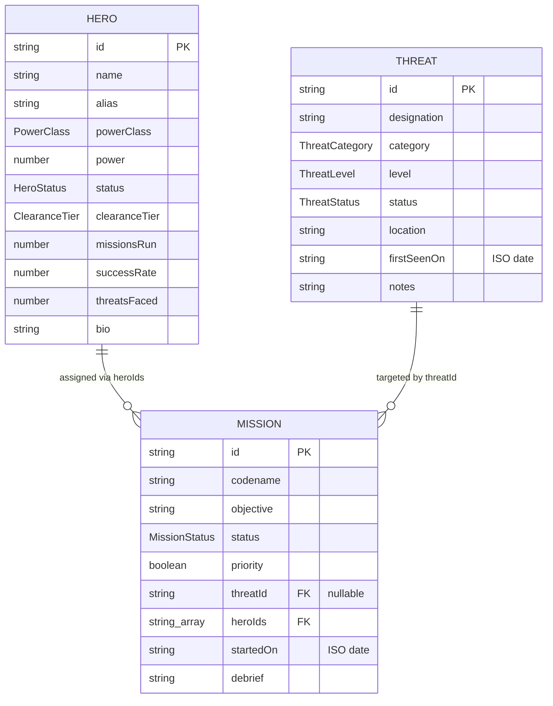
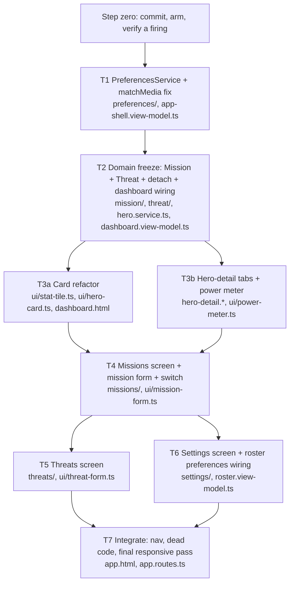
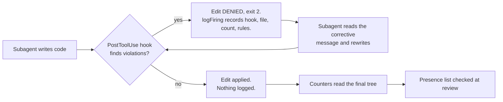

# Hero Ops Console: completion design

Date: 2026-09-07
Status: approved, pending implementation plan
Branch: `feat/hero-ops-console` (renamed from `scratch/verify-clean-build-src`)

## Why this document exists

The Hero Ops Console is roughly four sevenths built. This design finishes it, and specifies how the finishing is executed: every line of implementation is written by a Haiku subagent, under the project's own armed constitution, with verification that does not rely on the subagent's self-report.

The second half is not ceremony. This repository exists to measure whether a constitution of enforced rules lets a cheap model build real software safely. Finishing the application by hand would answer nothing. Finishing it with Haiku, under the gates, produces both an application and a measurement.

## Verified starting state

The following was measured on 2026-09-07 against the promoted `clean-build` source tree, not assumed.

| Check | Result |
| --- | --- |
| `ng build` | Pass. One warning: initial bundle 591.72 kB against a 500 kB budget. |
| `npm run check:boot`, default routes (dashboard, roster, detail/11) | Pass, no runtime errors |
| `npm run check:boot -- --route recruit --route missions --route threats --route settings` | Pass. All seven routes boot clean. |
| `npm run check:responsive` at 375 / 768 / 1280 | Pass |
| `eslint src` | Pass, no output |
| `stylelint src/**/*.css` | Pass, exit 0 |
| `npm run test:harness` | Pass. 17 files, 158 tests. |
| Sealing, layout, component-shape, freeloader counters | 0 across all 29 kinds |
| `npm test` (application unit tests) | **Fail, 2 of 2** |

The three defect classes that killed half the capstone builds are absent here: `hlm-dialog-content` sits correctly on `*hlmDialogPortal`, `provideIcons` is registered at root in `app.config.ts`, and no ViewModel is injected without being provided.

### The one real failure

`src/app/app-shell.view-model.ts:7` reads a bare global in a field initializer:

```ts
private readonly prefersDark = window.matchMedia('(prefers-color-scheme: dark)');
```

The field initializer runs the moment the injector constructs the ViewModel. jsdom does not implement `matchMedia`, so both application tests fail with `TypeError: window.matchMedia is not a function` before asserting anything. It works in a browser, which is why every browser-based gate waved it through. `CLAUDE.md` already forbids this ("Do not assume globals like `new Date()` are available"), and the file injects `DOCUMENT` on line 6 before reaching past it for a global on line 7. No gate catches this class.

The theme choice is also not persisted. The current code reads the media query once and never writes anything, so toggling works and forgets on reload. The capstone build spec requires persistence, with `prefers-color-scheme` respected only when the user has made no choice.

### What is missing, and why every gate reads clean anyway

- `missions.ts` and `threats.ts` are `template: '<h1>Missions</h1>'`. `settings.ts` says "Configuration panel under construction." Three of seven routes are empty, and an `<h1>` boots perfectly.
- `DashboardViewModel` returns `computed(() => 12)` for active missions and `computed(() => 5)` for threats. Two of the four numbers on the landing screen are fabricated.
- `hlm-card` is used nowhere. `dashboard.html:51` hand-rolls it as `rounded-lg border border-border bg-card p-4`.
- `hlm-tabs` is absent, so hero detail has no Overview / Powers / Missions / Edit structure.
- `hlm-switch` is absent.

Eleven primitive families are composed correctly: sidebar, avatar, badge, button, input, textarea, field, select with portal, dialog with portal, table, tooltip. The roster already does the responsive table correctly, hiding the table below `sm` and rendering a card grid instead.

This gap is the capstone's fifth finding arriving one level up: a gate measures what is present and cannot measure what is absent.

## Goals

1. Fix the `matchMedia` defect and persist the theme choice.
2. Give Missions and Threats a real domain with full create, edit, and delete, and real screens.
3. Give Settings real content: theme control plus display preferences that visibly change the application.
4. Restructure hero detail onto `hlm-tabs`, and add the missing `hlm-card` and `hlm-switch` vocabulary.
5. Do all of it with Haiku subagents, under armed gates, with verification that measures presence as well as absence.

## Non-goals

- Persisting entity data. Heroes, missions, and threats stay in memory, seeded from example data, and reset on refresh. Only preferences persist.
- Accessibility gating. The capstone names this as the largest unbuilt thing in the repository. It stays unbuilt here; this work must not make it worse, but adding an accessibility gate is separate.
- New dependencies. `card`, `tabs`, and `switch` are already vendored under `libs/ui/`, so `package.json` does not change, which matters because `package.json` is a protected path.
- Rebuilding what works. The sidebar, dialog portal, select portal, and responsive roster are correct and are not to be touched except where a task's file manifest names them.

## Section 1: the domain

Two new entities, each mirroring the existing `hero/` folder exactly, so the subagent copies a pattern rather than inventing one.

```
src/app/mission/                 src/app/threat/
  mission.model.ts                 threat.model.ts
  mission.schema.ts                threat.schema.ts
  mission.service.ts               threat.service.ts
  mission-example-data.ts          threat-example-data.ts
```

### Shapes



Enumerations:

- `MissionStatus`: `Planned | Active | Complete | Failed | Aborted`
- `ThreatLevel`: `Low | Moderate | Severe | Critical`
- `ThreatStatus`: `Active | Contained | Neutralized`
- `ThreatCategory`: `Kaiju | Rogue | Anomaly | Syndicate | Cosmic`

### Five decisions, each one a place a subagent would otherwise guess

**Dates are ISO strings, never `Date` objects.** `CLAUDE.md` forbids assuming globals such as `new Date()` are available. Rendering goes through `DatePipe`. A `Date` in a model is how that rule gets broken quietly.

**`Mission.priority` is a genuine boolean, and it is where `hlm-switch` lives.** The capstone build spec put a switch on the hero form for an `active` field, but `Hero.status` is now a four-way enum, so a boolean beside it would duplicate or contradict it. `Mission.priority` has a real use: it filters the missions list. The hero form gains no switch.

**Referential integrity is explicit.** Retiring a hero must detach that hero's id from every mission's `heroIds`. Deleting a threat must null the `threatId` on its missions. `HeroService.retire()` currently only filters the array; once missions hold hero ids, that leaves dangling references and a detail page rendering blanks. This is a change to existing code, not only new code.

**Cross-service writes flow one way.** `MissionService` may read `HeroService`. `HeroService` must not import `MissionService`. Detach-on-retire happens through a small `MissionService.detachHero(id)` that `HeroService` calls through an injected reference. One direction, no cycle.

**The dashboard's two fabricated tiles get wired to the real services.** `DashboardViewModel` gains `MissionService` and `ThreatService`, and the literals `12` and `5` are deleted. This is the acceptance test for the domain task: the dashboard numbers change when a mission is created.

Both new services are `providedIn: 'root'` singletons holding `signal<T[]>` seeded from example data, matching `HeroService`.

## Section 2: screens and components

### 2a. Preferences and the theme fix

New `src/app/preferences/preferences.service.ts`, `providedIn: 'root'`:

| Signal | Type | Default |
| --- | --- | --- |
| `theme` | `'light' \| 'dark' \| 'system'` | `'system'` |
| `rosterSort` | `'power' \| 'name' \| 'status'` | `'power'` |
| `rosterStatus` | `HeroStatus \| 'all'` | `'all'` |
| `compactTables` | `boolean` | `false` |

One localStorage key holds the whole object. Every read and every write is wrapped in `try/catch`, because a browser with site data blocked throws on access, not only on write. The browser is reached through `inject(DOCUMENT).defaultView`, never a bare `window`.

The three-state theme is what makes the requirement true rather than aspirational: effective dark is `theme === 'dark' || (theme === 'system' && prefersDark)`. A two-state boolean cannot express "the user has made no choice."

`AppShellViewModel` stops owning `matchMedia` and reads effective-dark from this service. `RosterViewModel` seeds its sort and status filter from it, so the Settings controls visibly change another screen.

### 2b. Hero detail becomes tabs

```
[< Back to roster]                            [Deploy] [Retire]
[ (avatar) Name / Alias / class + status badges ]
[ Overview | Powers | Missions | Edit ]
   Overview   field summary and dossier key/value pairs
   Powers     power meter and ability badges  (new app-power-meter)
   Missions   this hero's missions from MissionService, with result badges
   Edit       the existing app-hero-form
```

Composition, taken from the spartan documentation rather than from the library source:

```html
<hlm-tabs tab="overview" class="w-full">
  <hlm-tabs-list class="grid w-full grid-cols-4" aria-label="Hero sections">
    <button hlmTabsTrigger="overview">Overview</button>
    <button hlmTabsTrigger="powers">Powers</button>
    <button hlmTabsTrigger="missions">Missions</button>
    <button hlmTabsTrigger="edit">Edit</button>
  </hlm-tabs-list>
  <div hlmTabsContent="overview">...</div>
  <div hlmTabsContent="powers">...</div>
  <div hlmTabsContent="missions">...</div>
  <div hlmTabsContent="edit">...</div>
</hlm-tabs>
```

The `isEditing` boolean is deleted and the selected tab key replaces it. The existing `linkedSignal` reseed-on-hero-change behavior carries over to the tab signal, so navigating to a different hero returns the reader to Overview rather than stranding them in a stale editor. At 375 px the tab strip scrolls horizontally.

### 2c. Missions and Threats screens

Both mirror the roster exactly: a filter bar with search and a status select, a table at `sm` and above, a stacked card list below `sm`, and a footer count. The missions filter bar also carries a priority filter.

Create, edit, and delete happen in dialogs, not on detail routes. `hlm-dialog` with `*hlmDialogPortal` is already proven correct in `hero-detail.html`, so the subagent copies a known-good composition rather than composing a new one, and no new routes are added to boot-check.

### 2d. Card refactor

`hlm-card` replaces the hand-rolled `rounded-lg border border-border bg-card p-N` in five places: `ui/stat-tile.ts`, `ui/hero-card.ts`, `dashboard.html` (the roster preview block), and `hero-detail.html` in two places.

```html
<hlm-card>
  <hlm-card-header>
    <h3 hlmCardTitle>Card Title</h3>
    <p hlmCardDescription>Card Description</p>
    <div hlmCardAction>Card Action</div>
  </hlm-card-header>
  <div hlmCardContent>Card Content</div>
  <hlm-card-footer>Card Footer</hlm-card-footer>
</hlm-card>
```

Import `HlmCardImports` from `@spartan-ng/helm/card`. Note that `hlmCardTitle`, `hlmCardDescription`, `hlmCardContent`, and `hlmCardAction` are attribute directives, while `hlm-card`, `hlm-card-header`, and `hlm-card-footer` are element selectors.

### 2e. The switch, and how it binds

This repository uses Signal Forms, not `FormsModule` or `ReactiveFormsModule`. The proven pattern is in `ui/hero-form.ts`: a zod schema is the single source of truth, `form()` builds the model, `validateStandardSchema` supplies every rule, `[formRoot]` goes on the `<form>` element, `[formField]` goes on each control, and submission runs through `submission.action`. There is no `(ngSubmit)` anywhere, and there must not be: the orphan-ngSubmit rule bans it, and it is the exact defect that shipped four dead save buttons in the capstone.

`HlmSwitch` provides `NG_VALUE_ACCESSOR`. `[formField]` consumes a control value accessor directly, which is how `<hlm-select [formField]="heroForm.powerClass">` already works on `hero-form.ts:63`. So the first choice is:

```html
<hlm-field orientation="horizontal">
  <label hlmFieldLabel class="flex items-center gap-2">
    <hlm-switch [formField]="missionForm.priority" />
    Priority deployment
  </label>
</hlm-field>
```

The label wraps the switch rather than pointing at it with `for`. This is the documented spartan pattern, and it is also the accessible one: `<hlm-switch>` is a custom element, and a `<label for>` aimed at a custom element is one of the nine accessibility failure classes the capstone review already found in this codebase. If an explicit association is genuinely needed, `HlmSwitch` exposes an `inputId` input that sets the id on the underlying `brn-switch`; a plain `id` attribute lands on the host element and associates the label with nothing interactive.

This binding has not been proven against `HlmSwitch` specifically. If `[formField]` does not bind, the fallback is `[checked]` with `(checkedChange)` writing the model signal directly. The implementation plan carries this as a verification step, not an assumption. Under no circumstances is `ngModel` the answer.

## Section 3: execution

### Step zero

1. Commit the promoted `clean-build` source on the scratch branch and rename it `feat/hero-ops-console`, so every subsequent task lands as one reviewable diff against a clean tree. That commit also carries the deletion of `src/app/heroes/heroes.ts`, an orphan placeholder that no route references; `clean-build` had removed it, and `git checkout clean-build -- src/` could not delete it during promotion.
2. Arm the gates: `Copy-Item .claude\gates.settings.json .claude\settings.json`, then restart the session. Hooks are captured at session start, so a file written mid-session may sit inert.
3. Confirm arming by observing a hook actually fire, deliberately, before dispatching anything. An unverified assumption that the constitution is on would invalidate the entire run.

Arming has consequences worth stating in advance. `protect-enforcement.mjs` denies edits to `stylelint.config.mjs`, `eslint.config.mjs`, `harness/`, `.claude/hooks/`, `.claude/skills/`, `.claude/settings.json`, `.agents/skills/`, `components.json`, `experiments/`, `package.json`, `tsconfig*.json`, and `.mcp.json`. That includes the settings file itself, so the constitution cannot be disarmed from inside the session; only the user can, from outside. The Bash arm scans command text for protected substrings, so `node harness/gate/check-boot.mjs --route x` is denied while `npm run check:boot -- --route x` passes. Every command in the verification bar below was checked against that allowlist.

### Waves and tasks

Parallelism is partitioned by file, never by concept. Two subagents editing `hero-detail.html` simultaneously is the collision that costs an afternoon.



T1 is deliberately the smallest task in the set. It makes `npm test` go green and it proves the whole loop, including arming, prompt contract, verification bar, and the bounce rule, before anything expensive rides on it. If T1 goes badly, that is learned for the price of a two-line fix.

T3a and T3b are file-disjoint, which is why they run together. The card work inside `hero-detail.html` belongs to T3b, not T3a, because T3b owns that file. T5 deliberately follows T4 rather than running beside it, so that it copies a settled entity-CRUD-in-dialog pattern instead of inventing a second one. T6 is disjoint from both and runs beside T5.

### The verification bar

Every task runs all of the following and does not report done until each passes:

```
npm run build
npm run lint
npm test
npm run test:harness
npx stylelint "src/**/*.css"
npm run check:boot -- --route <every route this task touches>
node harness/counter/counter.mjs --root . src
node harness/counter/layout-counter.mjs --root . src
node harness/counter/component-shape-counter.mjs --root . src
node harness/counter/freeloader-counter.mjs --root . src
```

All four counters must report `"all": 0`. `npm run check:responsive` runs at wave boundaries rather than per task, because it needs a full production build and only pays off at integration points.

### Three instruments, because two of them measure the same absence

This is the heart of the verification design, and it exists because a zero is easy to misread.

A hook firing is logged only when a hook found violations and denied the edit. Every `logFiring` call in every hook sits after an early exit on a clean file, so clean edits log nothing. A firing record carries the hook name, the file, a count of violations in that blocked edit, and the rule ids.



| Instrument | Answers | Blind to |
| --- | --- | --- |
| Firings | Did the constitution do any work, and on what? | Code never written |
| Counters | Does surviving code violate a named rule? | Code never written |
| Presence list | Does the feature exist at all? | Nothing, but it is not automatable from a rule |

`counter = 0` is ambiguous across three worlds that look identical from outside: the model never wrote the violation, the model wrote it and a hook corrected it, or the model never wrote the code. Firings separate the first from the second. Nothing separates the third, which is exactly the state `clean-build` shipped in: three stub screens, two fabricated dashboard numbers, and all twenty-nine rules reading clean.

The worst state to be in is high code volume with zero counters and zero firings, because it reads identically whether the subagent is excellent, the bar was never run, or the screen is empty.

Therefore: **`counter = 0` is a necessary condition and never a sufficient one.** No zero in this run may be cited as evidence of quality without its accompanying firing count and presence check.

### Presence lists

Every task prompt carries an explicit list of things that must exist when it is done. These are checked by the reviewer, not self-reported by the implementer. Illustrative, for T4:

- `missions.html` contains `hlmTable`, `hlmBadge`, and an `@for` over the ViewModel's filtered signal
- `mission-form` contains `hlm-switch` bound to the `priority` field
- `MissionService.create`, `update`, and `delete` are each reachable from a template path
- the `/missions` route renders substantive content, not an `<h1>` alone
- `DashboardViewModel.activeMissions()` returns `MissionService` data and the literal `12` is gone

Every task gets an equivalent list in the implementation plan.

### The subagent prompt contract

Each Haiku task prompt contains exactly these, and nothing else:

1. The task's file manifest: the exact paths it may create or modify.
2. The relevant section of this document, verbatim.
3. A named existing file whose shape it must copy, for example `roster.view-model.ts` for a ViewModel or `hero-form.ts` for a form.
4. The documented composition snippets for any primitive it needs.
5. An explicit instruction to call the spartan MCP server before writing any `hlm-*` markup it has not written before.
6. The verification bar, and the rule that it does not report done until every command passes.
7. The presence list for that task.
8. The prohibition: enforcement paths are not editable. If a rule blocks the work, say so in the final response and explain why. Do not edit the rule.

Item five is load-bearing. In the capstone's first round the spartan MCP was configured and passed on every run, and across 36 subagents and 1,752 tool calls it was invoked zero times. After one paragraph naming that failure was added to `CLAUDE.md`, round two used it five to ten times per trial and the dependency-injection failures stopped.

### Review

Per the standing model policy: Sonnet reviews at each wave boundary, Opus reviews before merge. The Opus review runs every time, no matter how green the work looks.

### The bounce rule

The orchestrator never hand-patches a subagent's output. A failed verification bar or a review finding becomes a new Haiku task with the failure text attached. The moment the orchestrator fixes it directly, the run stops being a measurement of whether a cheap model can build this under the constitution and becomes the orchestrator building it with extra steps.

### Kill switches

Three signals mean stop and re-plan rather than push harder:

1. **A task needs a third Haiku attempt.** Implementation is locked to Haiku, so there is no escalation path. A third failure means the task is cut wrong, not that the model is wrong. Split it and bring the split to the user.
2. **A counter reads non-zero after a wave the subagent reported green.** The verification bar is not actually being run, which makes every prior green suspect and requires re-verifying completed waves.
3. **`protect-enforcement` fires on an enforcement path.** That is the capstone's fourth finding happening live. It invalidates the run's meaning even if the resulting code is fine, and it must be reported rather than worked around.

### Telemetry this run produces for free

`.claude/hook-firings.jsonl` accumulates every firing, and `npm run firings` rolls it up. This build therefore produces the capstone's own metric on real work rather than on a trial: firings per wave, rules triggered, and MCP calls per task. If the gates never fire across all eight tasks, that is not proof the constitution works; it is the same "armed but untested" caveat already recorded against `nested-flex-grid`.

## Risks and open questions

**`[formField]` on `HlmSwitch` is unproven.** Verified as part of T4, with a documented fallback. Low cost if wrong.

**The bundle is already 91.72 kB over budget** before three screens are added. The budget will need raising or the lazy chunking revisiting. This is noted, not solved here, and it must not be solved by an implementation subagent silently editing `angular.json`.

**Eight tasks may be too coarse.** T2 and T4 are the heaviest. The bias is to split rather than merge, and splitting mid-run is allowed; merging is not.

**Round-2 style confounding applies.** This run changes the application, arms the gates, and introduces new domain simultaneously. It can show that the constitution held across eight tasks. It cannot attribute any outcome to a single rule.

**Accessibility remains ungated.** Nine failure classes were identified in the capstone review and nothing checks for them. This work should not add to them, and the tab strip, switch labels, and dialog titles are the three places most likely to.
